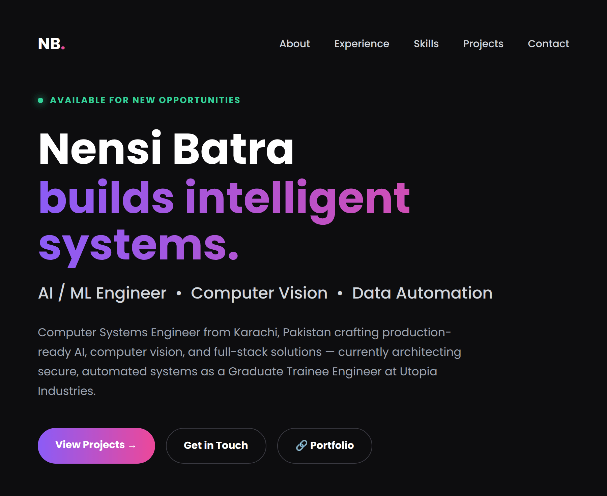
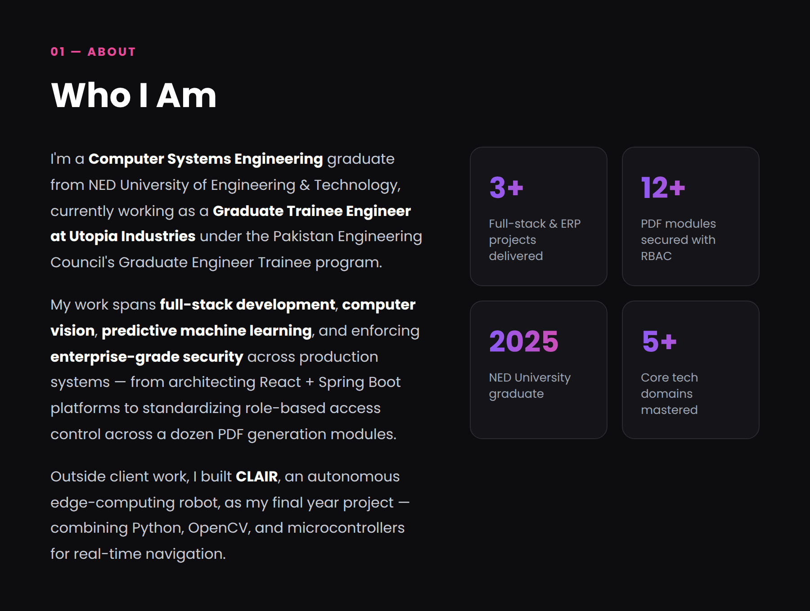
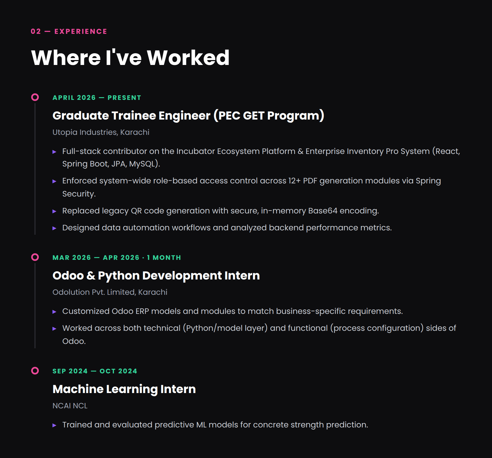
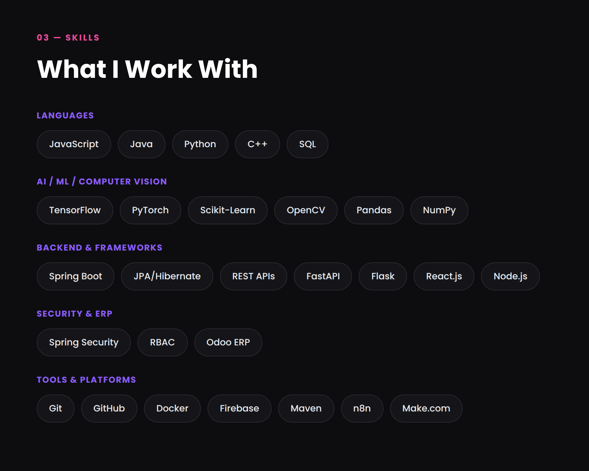
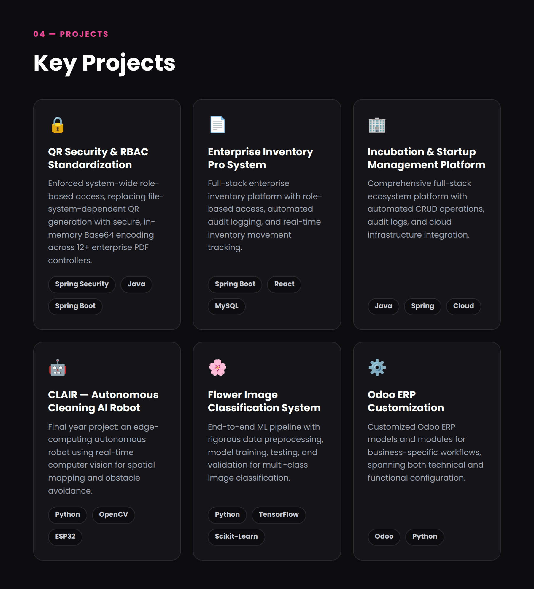
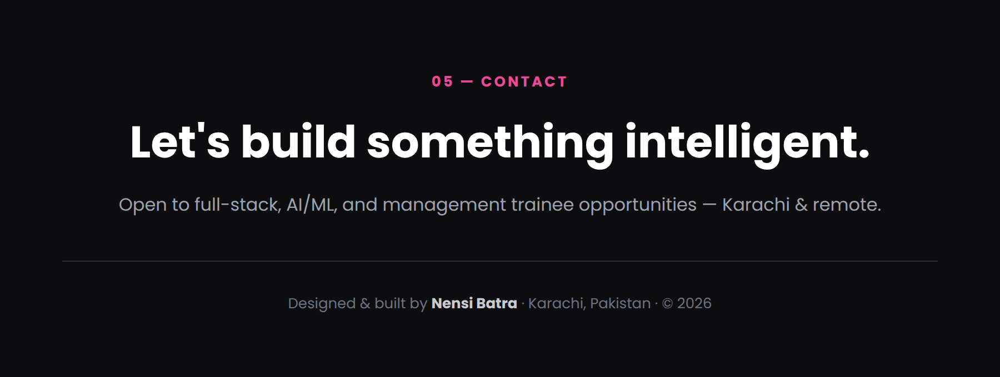

<!-- ═══════════════ ANIMATED TOP WAVE ═══════════════ -->

<!-- ═══════════════ HERO ═══════════════ -->

 

<!-- ═══════════════ SOCIALS ═══════════════ -->

  

  

<!-- gradient divider -->

<!-- ═══════════════ ABOUT ═══════════════ -->

<!-- ═══════════════ EXPERIENCE ═══════════════ -->

<!-- ═══════════════ SKILLS ═══════════════ -->

 

<b>🧠 &nbsp;Full Tech Stack — click to expand</b>

 

  

  

 

<!-- ═══════════════ PROJECTS ═══════════════ -->

 

<!-- ═══════════════ GITHUB STATS ═══════════════ -->
<h3>📊 &nbsp;GitHub Analytics</h3>

  

  

<!-- ═══════════════ TROPHIES ═══════════════ -->

  

<!-- ═══════════════ ACTIVITY GRAPH (animated line) ═══════════════ -->

  

<!-- ═══════════════ CONTRIBUTION SNAKE ═══════════════ -->
<picture>
  <source media="(prefers-color-scheme: dark)" srcset="https://raw.githubusercontent.com/Nensibatra1122/Nensibatra1122/output/github-contribution-grid-snake-dark.svg" />
  <source media="(prefers-color-scheme: light)" srcset="https://raw.githubusercontent.com/Nensibatra1122/Nensibatra1122/output/github-contribution-grid-snake.svg" />
  
</picture>

  

<!-- ═══════════════ QUOTE ═══════════════ -->

  

<!-- ═══════════════ FOOTER ═══════════════ -->

 

  

